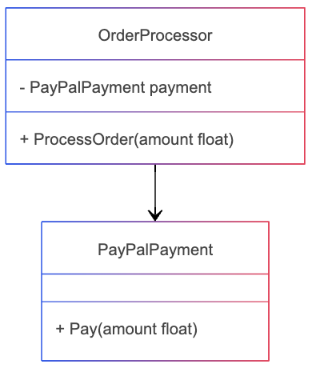
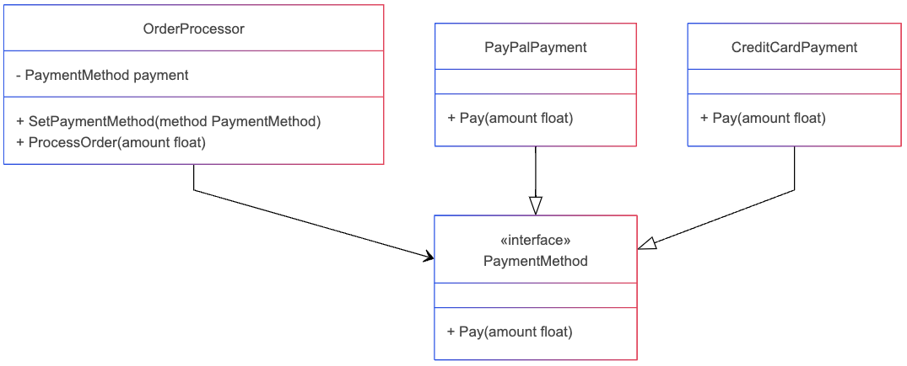

## Principio de Inversión de Dependencias (DIP)
### ¿Qué es?
El Principio de Inversión de Dependencias (DIP) establece que los módulos de alto nivel no deben depender de módulos de bajo nivel, sino de abstracciones. Además, las abstracciones no deben depender de detalles concretos; los detalles deben depender de abstracciones.

### ¿Cuándo se usa?
Se usa cuando queremos desacoplar los componentes de un sistema, permitiendo que las clases de alto nivel no dependan directamente de las implementaciones concretas, sino de interfaces o abstracciones.

### ¿Por qué se usa?
Para evitar el acoplamiento fuerte entre componentes.
Para facilitar la extensibilidad y mantenibilidad del código.
Para permitir la inyección de dependencias, facilitando pruebas unitarias y cambios de implementación.

### ¿Qué beneficios trae?
- ✅ Reducción del acoplamiento: Permite cambiar las implementaciones sin afectar los módulos de alto nivel.
- ✅ Mayor flexibilidad: Se pueden agregar nuevas funcionalidades sin modificar código existente.
- ✅ Facilita las pruebas unitarias: Permite el uso de mocks o stubs en lugar de implementaciones concretas.
- ✅ Mejor organización del código: Promueve una arquitectura más limpia y modular.

### ¿Qué problemas trae?
- ❌ Mayor complejidad: Requiere definir interfaces y aplicar inyección de dependencias correctamente.
- ❌ Sobreingeniería en casos simples: Si el sistema es pequeño, puede agregar complejidad innecesaria.
- ❌ Curva de aprendizaje: Puede ser difícil de entender e implementar correctamente para principiantes.

### ¿Cómo se complementa o interfiere con otros principios de diseño?
- Se relaciona con OCP (Principio de Abierto/Cerrado) porque permite cambiar implementaciones sin modificar el código existente.
- Está vinculado con el Principio de Sustitución de Liskov (LSP) ya que al trabajar con abstracciones, las implementaciones deben respetar los contratos definidos.
- Es clave para la Inversión de Control (IoC) y la Inyección de Dependencias (DI), reduciendo el acoplamiento y mejorando la modularidad.
Se complementa con el Patrón Strategy, ya que este patrón también usa abstracciones para definir comportamientos intercambiables.

## Diagrama de clases Violentando el Principio DIP

## Diagrama de clases aplicando el Principio DIP
