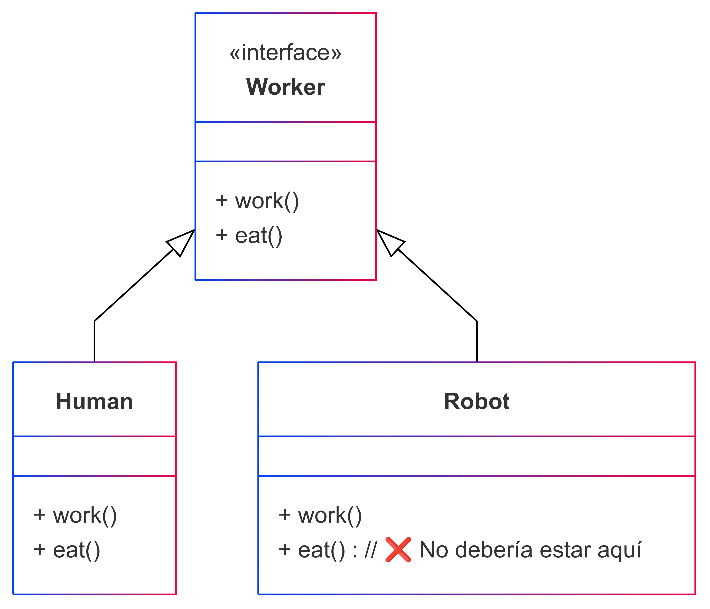
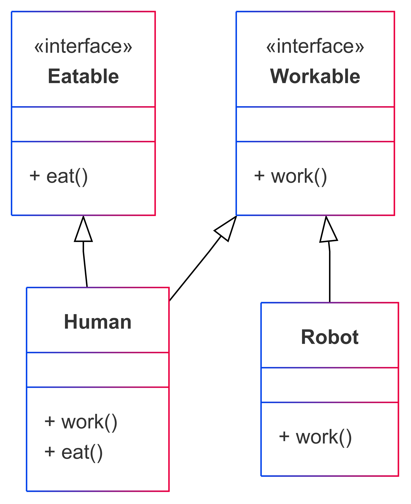

# Principio de Segregación de Interfaces (ISP)
### 📌 Definición corta
El Principio de Segregación de Interfaces (ISP) establece que una clase no debe verse obligada a depender de métodos que no usa.
En otras palabras, es mejor tener múltiples interfaces pequeñas y específicas en lugar de una interfaz grande y genérica.

### 📌 Cuándo se usa?
Se usa cuando una interfaz tiene demasiados métodos, y algunas clases que la implementan no necesitan todos esos métodos.

### 📌 Por qué se usa?
Para evitar que las clases dependan de métodos innecesarios y reducir el acoplamiento entre módulos.

### 📌 Qué beneficios trae?
- ✅ Menos dependencia en métodos innecesarios.
- ✅ Facilita la reutilización y el mantenimiento del código.
- ✅ Cumple con el Principio de Responsabilidad Única (SRP) porque cada interfaz tiene un propósito claro.

### 📌 Qué problemas trae?
- ❌ Puede generar demasiadas interfaces pequeñas, aumentando la complejidad si no se diseña bien.
- ❌ Puede hacer que haya más código "boilerplate" al definir muchas interfaces.

### 📌 Cómo se complementa con otros principios?
- 🔹 SRP (Principio de Responsabilidad Única): ISP ayuda a que las interfaces tengan una única responsabilidad clara.
- 🔹 DIP (Principio de Inversión de Dependencias): ISP permite que las dependencias sean más específicas y flexibles.

## Diagrama de clases violando el principio

## Diagrama de clases aplicando el principio
