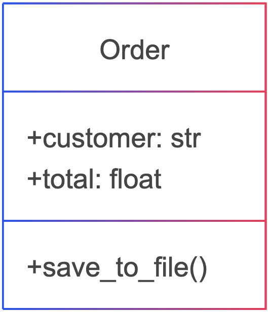
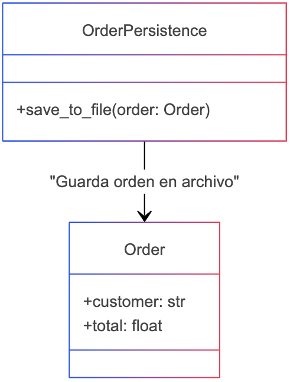

# Patrón pure fabrication
## 📌 Definición
El patrón Pure Fabrication se usa para crear clases artificiales que no representan conceptos del dominio, pero ayudan a separar responsabilidades y mejorar la organización del código.

## 📌 Cuándo se usa?
Se usa cuando una clase tiene responsabilidades adicionales que no deberían estar dentro de ella.

## Ejemplos comunes:

Una entidad de dominio maneja persistencia de datos.
Un modelo de negocio también maneja formateo o generación de reportes.
Una clase que debería representar solo datos también incluye lógica de negocio.
## 📌 Por qué se usa?
Se usa para mejorar la separación de responsabilidades, reducir el acoplamiento y aumentar la reutilización del código.

- ✅ Evita que las clases del dominio manejen lógica extra.
- ✅ Facilita cambios sin afectar el modelo de negocio.
- ✅ Hace el código más limpio y mantenible.

## 📌 Qué beneficios trae?
- ✔ Baja el acoplamiento: Separa responsabilidades en clases especializadas.
- ✔ Mejor reutilización: Permite reusar lógica sin afectar el dominio.
- ✔ Más fácil de probar: Clases más pequeñas y enfocadas.

## 📌 Qué problemas trae?
- ❌ Puede aumentar la cantidad de clases, si se usa en exceso.
- ❌ Puede hacer el código más complejo si la separación no es clara.

## 📌 Cómo se complementa con otros principios?
- 🔹 SRP (Single Responsibility Principle): Separa responsabilidades en clases dedicadas.
- 🔹 Low Coupling: Reduce dependencias innecesarias entre clases.
- 🔹 Information Expert: Ayuda a mover la lógica a una clase más adecuada.

# Diagrama violentando el patrón pure fabrication

# Diagrama aplicando el patrón pure fabrication

